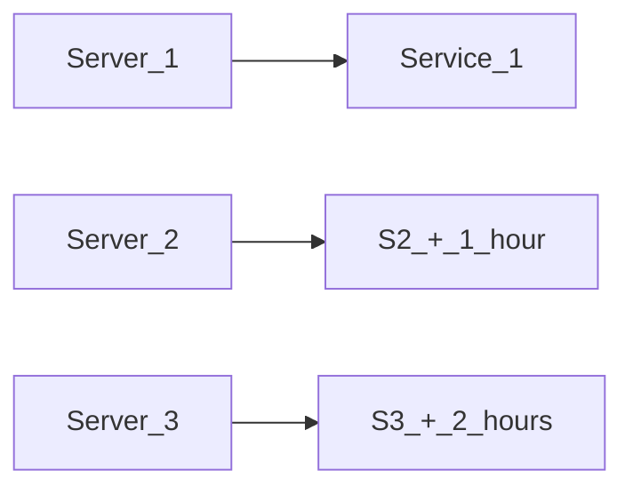

# README

 This Rails app is an implementation of a url shortener kike TinyURL

Shortened URLs are generated using a base64 token strategy, trying to avoid collisions.
I using `Process.clock_gettime(Process::CLOCK_REALTIME, :millisecond)` to make unique number with 13 digit. Base on it and a base64, I encoded the original URL
So now the shortener code start with 7 characters, and it will increase in the future when `Process.clock_gettime` have more than 13 digit


## Technologies


* Ruby 2.7.5

* Rails 6.1.4

* Postgres 14


## Development with Docker


Building api image:

```sh

docker-compose build

```


Setting the database up:

```sh

docker-compose run api rake db:create

docker-compose run api rake db:migrate

```


Running the app:

```sh

docker-compose up

```


Running the test:

```sh

docker-compose run api rails test

```

## Potential attack vectors on the ShortUrl like TinyURL


URL-shortening services provide attackers and spammers with phishing methods with the following options:

-   Allow spammers to sidestep spam filters as domain names like TinyURL are automatically trusted.
-   Prevent educated users from checking for suspect URLs by obfuscating the actual Website URL.
-   Redirect users to phishing sites to capture sensitive personal information.
-  Redirect users to malicious sites loaded and just waiting to download malware.
-  Via shortened URLs  DDoS victims
- Using shortened URLs provides some protection for the attackers, as they cannot be reported for brand infringement.

### Referenced:
- https://www.techrepublic.com/article/url-shortening-yet-another-security-risk/
- https://portswigger.net/daily-swig/cybercriminals-use-reverse-tunneling-and-url-shorteners-to-launch-virtually-undetectable-phishing-campaigns


## Problems and Scale applications


### 1. Server
Now  I use real-time to generate unique a number. For the unique number make sure to create a unique code for the ShortURL

But it comes true when we use a single server when you scale out multiple servers. We will be facing with `race condition` how about if two requests come to two servers at the same time? This is a problem, so for scale-out we need to move out the generate unique a number to the service.

When the generate unique a number service moves out. All servers request service for unique a number. To avoid a bottleneck (hot point) we must have multiple services and for each service, we add span time when generating unique a number, it makes sure each service allway give unique a number.




For esier the management to add also remove one of service or server gone down we can consider use Zookeeper

### 2. DB

Now we use Postgres for the database, it have contraint with AICD. But we only need to store the short URL to long URL mapping. When the user gives us the short URL, we just need to get the long URL using the 7 character random string in the short URL. We do not need to perform any relational queries or joins to store or get this data. So we do not need a SQL database. As far as No-SQL databases are concerned, there are various types of No-SQL databases like document database, graph database, column database, key-value database etc. As we can clearly see, our service uses a simple key value mapping. Therefore we can go with a No-SQL key-value pair database.Some of the popular ones are Amazon DynamoDB, Oracle NoSQL Database, InfinityDB, MongoDB etc. As far as the scale is concerned, most of these No-SQL solutions scale well with increasing data.

### 3. load balancer

Load balancer as the name suggests, balances the load by distributing the requests across our servers. There are various kinds of load balancers, each type having its own logic on how to distribute the load, but for our use case lets keep this simple by assuming the load balancer redirects the requests depending on which server is free or available to process the request.

### 4. Cache

We can optimize this design further by adding a caching layer to our service. With the current design our servers have to talk to the database every time the user clicks on the short URL, in order to retrieve the short URL to long URL mapping. Database calls can be slow and expensive as compared to fetching the data from a cache which is essentially an in-memory storage. We can improve the response time of our APIs by caching frequently accessed short URLs so that when we get a request for a short URL our servers will first check to see if the data is available in cache, if yes it retrieves the data from cache, otherwise it fetches it from database.


### Referenced:
- https://medium.com/@sandeep4.verma/system-design-scalable-url-shortener-service-like-tinyurl-106f30f23a82
- https://www.geeksforgeeks.org/system-design-url-shortening-service/
- https://www.code-recipe.com/post/url-shortener

## TODO

- [ ] Make Authentication Feature
- [ ] Move Database To MogodDB
- [ ] Setup Cache With Redis
- [ ] Challenge With Same Original URL Return Same Code Don't Hit DB
